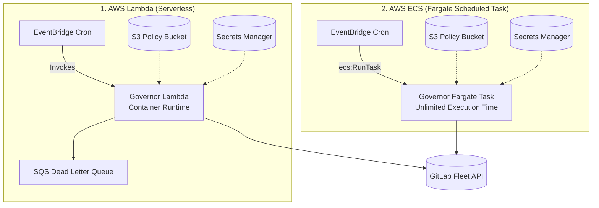

# GitLab Fleet Governor CloudFormation Templates

This directory contains production-ready AWS CloudFormation templates for deploying **GitLab Fleet Governor**, a high-performance declarative policy-as-code and compliance auditing engine for GitLab fleets.

---

## 🏛️ Deployment Architectures



| Architecture | Template | Recommended Use Case | Max Duration | Cost Profile |
| :--- | :--- | :--- | :--- | :--- |
| **AWS Lambda** | [`gitlab-fleet-governor-lambda.yaml`](./gitlab-fleet-governor-lambda.yaml) | Periodic policy runs, event-driven triggers (fleets < 1,000 repos) | 15 minutes (hard limit) | **Pay-per-execution** ($0 at idle) |
| **ECS Fargate** | [`gitlab-fleet-governor-ecs-fargate.yaml`](./gitlab-fleet-governor-ecs-fargate.yaml) | Large enterprise fleets (> 1,000 to > 10,000 repos), full compliance audits | **Unlimited** | **Pay for task duration only** (Fargate Spot supported) |

---

## 1. AWS Lambda Deployment (`gitlab-fleet-governor-lambda.yaml`)

Deploy GitLab Fleet Governor as an OCI container image running on AWS Lambda custom runtime.

### Features
- **Auto-Detection**: The Go binary automatically detects `AWS_LAMBDA_FUNCTION_NAME` and shifts from CLI mode to the Lambda serverless event loop.
- **EventBridge Schedule**: Configurable cron schedule (e.g. `cron(0 2 * * ? *)` daily at 02:00 UTC).
- **Secrets Manager Integration**: Securely decrypts `GITLAB_TOKEN` without hardcoding credentials.
- **Dead Letter Queue (SQS)**: Automatically retains execution failures for 14 days for forensic investigation.
- **VPC Support (Optional)**: Can attach to private VPC subnets to reach internal self-managed GitLab instances.

### Deployment with AWS CLI

```bash
aws cloudformation deploy \
  --template-file gitlab-fleet-governor/gitlab-fleet-governor-lambda.yaml \
  --stack-name gitlab-fleet-governor-lambda-prod \
  --capabilities CAPABILITY_NAMED_IAM \
  --parameter-overrides \
    EnvironmentName=prod \
    ImageUri="ghcr.io/divmora/gitlab-fleet-governor-lambda:latest" \
    GitLabTokenSecretArn="arn:aws:secretsmanager:us-east-1:123456789012:secret:gitlab-token-xxxx" \
    ConfigSource="s3://my-governance-policies/production.yaml" \
    ScheduleCron="cron(0 2 * * ? *)" \
    DryRun="true" \
    Concurrency=10
```

### Manual Trigger via AWS CLI

```bash
aws lambda invoke \
  --function-name gitlab-fleet-governor-prod \
  --payload '{"dry_run": true, "group_paths_include": ["core-infrastructure"]}' \
  --cli-binary-format raw-in-base64-out \
  response.json

cat response.json
```

---

## 2. AWS ECS Fargate Deployment (`gitlab-fleet-governor-ecs-fargate.yaml`)

Deploy GitLab Fleet Governor as a scheduled container task on AWS ECS Fargate for large-scale enterprise environments.

### Why ECS for Large Fleets?
When governing fleets spanning thousands of groups and repositories, a full crawl with deep branch protections, approval rules, and member permission analysis may exceed AWS Lambda's 15-minute timeout. ECS Fargate allows tasks to run indefinitely with configurable CPU (up to 16 vCPUs) and RAM (up to 120 GB).

### Features
- **Serverless Compute**: Fully managed AWS Fargate infrastructure with FARGATE and FARGATE_SPOT capacity providers.
- **Dedicated Outbound Security Group**: Automatically provisions an egress-only HTTPS security group if none is provided.
- **EventBridge Scheduled Task**: Launches `ecs:RunTask` automatically according to your cron schedule.
- **Configurable Action**: Supports either `run` (declarative policy reconciliation) or `audit` (compliance & security posture scan).

### Deployment with AWS CLI

```bash
aws cloudformation deploy \
  --template-file gitlab-fleet-governor/gitlab-fleet-governor-ecs-fargate.yaml \
  --stack-name gitlab-fleet-governor-ecs-prod \
  --capabilities CAPABILITY_NAMED_IAM \
  --parameter-overrides \
    VpcId="vpc-0123456789abcdef0" \
    SubnetIds="subnet-0123456789abcdef0,subnet-0fedcba9876543210" \
    EnvironmentName=prod \
    ImageUri="ghcr.io/divmora/gitlab-fleet-governor:latest" \
    GitLabTokenSecretArn="arn:aws:secretsmanager:us-east-1:123456789012:secret:gitlab-token-xxxx" \
    ConfigSource="s3://my-governance-policies/production.yaml" \
    ScheduleCron="cron(0 2 * * ? *)" \
    CommandAction="run" \
    DryRun="false" \
    Concurrency=16
```

### Manual Trigger via AWS CLI

```bash
# Immediately trigger an ad-hoc run without waiting for cron schedule
aws ecs run-task \
  --cluster gitlab-fleet-governor-cluster-prod \
  --task-definition gitlab-fleet-governor-prod \
  --launch-type FARGATE \
  --network-configuration "awsvpcConfiguration={subnets=[subnet-0123456789abcdef0],assignPublicIp=ENABLED}"
```
