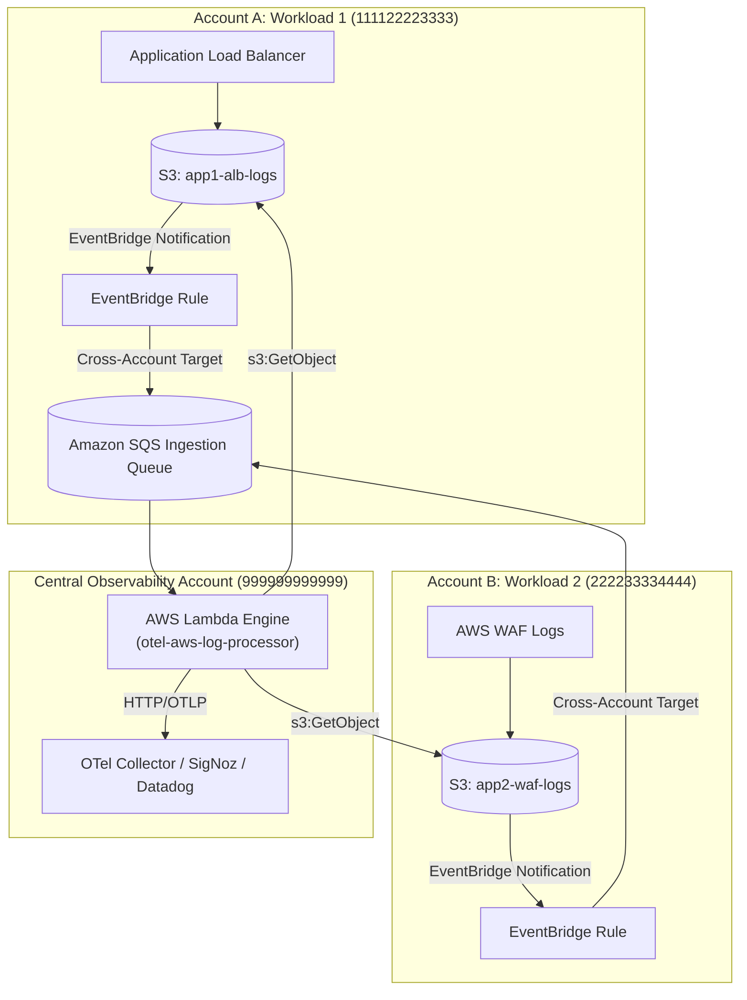

# AWS Log to OpenTelemetry (OTLP) Processor CloudFormation Templates

This directory contains production-ready AWS CloudFormation templates for deploying **`otel-aws-log-processor`**, a high-performance Go-based serverless Lambda application that parses and converts AWS access logs into OpenTelemetry (OTLP) log records, exporting them via HTTP to OTLP-compatible backends (SigNoz, OpenTelemetry Collector, Coralogix, Datadog).

---

## 🏛️ Deployment Architecture

```mermaid
flowchart LR
    subgraph S3["1. Log Generation & Storage"]
        ALB["Application Load Balancer (.log.gz)"] --> B1[(S3 Log Bucket)]
        NLB["Network Load Balancer (.log.gz)"] --> B1
        CF["CloudFront Access Logs (.gz, .parquet)"] --> B1
        WAF["AWS WAF Access Logs (.json.gz)"] --> B1
    end

    subgraph Messaging["2. Event Notification"]
        B1 -->|s3:ObjectCreated:*| SQS["SQS Ingestion Queue<br/>(Visibility: 180s)"]
        SQS -.->|After 3 retries| DLQ["SQS Dead Letter Queue<br/>(Retention: 14 days)"]
    end

    subgraph Lambda["3. Serverless Processing (otel-aws-log-processor)"]
        SQS -->|EventSourceMapping<br/>(Batch: 10, Concurrency: 10)| Func["AWS Lambda Function<br/>(arm64 Graviton / provided.al2023)"]
        Func -->|s3:GetObject| B1
    end

    subgraph Backends["4. Observability Export"]
        Func -->|HTTP POST /v1/logs<br/>(OTLP JSON with divmora.license.* tags)| OTLP["OTLP-Compatible Backend<br/>(SigNoz, OTel Collector, Datadog)"]
    end
```

---

## 📁 Template Overview

| Template | Deployment Type | Recommended Use Case | Default Architecture |
| :--- | :--- | :--- | :--- |
| [`otel-aws-log-processor-lambda.yaml`](./otel-aws-log-processor-lambda.yaml) | **AWS Lambda (Serverless)** | Real-time S3 log ingestion for ALB, NLB, CloudFront, and WAF | `arm64` (AWS Graviton) |

---

## 🚀 Deployment Instructions

### 1. Deploy with AWS CLI (Container Image via GHCR/ECR)

```bash
aws cloudformation deploy \
  --template-file otel-aws-log-processor/otel-aws-log-processor-lambda.yaml \
  --stack-name otel-aws-log-processor-prod \
  --capabilities CAPABILITY_NAMED_IAM \
  --parameter-overrides \
    EnvironmentName=prod \
    DeploymentType=Container \
    ImageUri="ghcr.io/divmora/otel-aws-log-processor:latest" \
    OtlpLogsEndpoint="https://otel.mycorp.internal/v1/logs" \
    BasicAuthPasswordSecretArn="arn:aws:secretsmanager:us-east-1:123456789012:secret:otel-basic-auth" \
    LogSourceBucketArns="arn:aws:s3:::my-alb-logs-bucket,arn:aws:s3:::my-waf-logs-bucket" \
    DivmoraLicenseMode=warn
```

### 2. Deploy with AWS CLI (Static Binary Zip from S3)

```bash
# 1. Build and upload package to S3
make lambda-package
aws s3 cp lambda.zip s3://my-deploy-bucket/otel-aws-log-processor/lambda.zip

# 2. Deploy CloudFormation stack
aws cloudformation deploy \
  --template-file otel-aws-log-processor/otel-aws-log-processor-lambda.yaml \
  --stack-name otel-aws-log-processor-prod \
  --capabilities CAPABILITY_NAMED_IAM \
  --parameter-overrides \
    EnvironmentName=prod \
    DeploymentType=Zip \
    CodeS3Bucket="my-deploy-bucket" \
    CodeS3Key="otel-aws-log-processor/lambda.zip" \
    OtlpLogsEndpoint="https://otel.mycorp.internal/v1/logs" \
    LogSourceBucketArns="arn:aws:s3:::my-alb-logs-bucket" \
    DivmoraLicenseMode=warn
```

---

## 🔗 Configuring S3 Bucket Notifications

Once the CloudFormation stack completes, retrieve the SQS Ingestion Queue ARN from the stack outputs:

```bash
QUEUE_ARN=$(aws cloudformation describe-stacks \
  --stack-name otel-aws-log-processor-prod \
  --query "Stacks[0].Outputs[?OutputKey=='IngestionQueueArn'].OutputValue" \
  --output text)
```

Configure your S3 log bucket to notify the SQS queue when logs arrive:

```bash
aws s3api put-bucket-notification-configuration \
  --bucket my-alb-logs-bucket \
  --notification-configuration '{
    "QueueConfigurations": [
      {
        "QueueArn": "'"${QUEUE_ARN}"'",
        "Events": ["s3:ObjectCreated:*"]
      }
    ]
  }'
```

---

---

## 🌐 Multi-Bucket & Cross-Account EventBridge Architecture

When your workload resources (ALBs, NLBs, CloudFront, WAF) write logs to **multiple S3 buckets across multiple AWS accounts**, you can stream them all to a single central `otel-aws-log-processor` instance deployed in a **Central Observability Account**.



### 1. Deploy Central Stack with Cross-Account Permissions

Deploy the stack in your **Central Observability Account**, specifying which external accounts or AWS Organization can send events to the queue:

```bash
aws cloudformation deploy \
  --template-file otel-aws-log-processor/otel-aws-log-processor-lambda.yaml \
  --stack-name otel-aws-log-processor-central \
  --capabilities CAPABILITY_NAMED_IAM \
  --parameter-overrides \
    EnvironmentName=prod \
    OtlpLogsEndpoint="https://otel.mycorp.internal/v1/logs" \
    AllowedSourceAccountIds="111122223333,222233334444" \
    OrganizationId="o-abcdef1234" \
    LogSourceBucketArns="arn:aws:s3:::app1-alb-logs,arn:aws:s3:::app1-alb-logs/*,arn:aws:s3:::app2-waf-logs,arn:aws:s3:::app2-waf-logs/*"
```

### 2. Configure Source Workload Accounts (Account A, Account B)

In each external source account:

1. **Enable EventBridge on the S3 bucket**:
   ```bash
   aws s3api put-bucket-notification-configuration \
     --bucket app1-alb-logs \
     --notification-configuration '{"EventBridgeConfiguration": {}}'
   ```

2. **Add Bucket Policy** permitting the central Lambda execution role to read log files:
   ```json
   {
     "Version": "2012-10-17",
     "Statement": [
       {
         "Sid": "AllowCentralLogProcessorRead",
         "Effect": "Allow",
         "Principal": {
           "AWS": "arn:aws:iam::999999999999:role/otel-aws-log-processor-role-prod"
         },
         "Action": ["s3:GetObject", "s3:ListBucket"],
         "Resource": [
           "arn:aws:s3:::app1-alb-logs",
           "arn:aws:s3:::app1-alb-logs/*"
         ]
       }
     ]
   }
   ```

3. **Deploy an EventBridge Rule** in the source account forwarding S3 `Object Created` events to the central SQS queue:
   ```yaml
   Type: AWS::Events::Rule
   Properties:
     Description: Forward S3 access log events to Central SQS queue
     EventPattern:
       source: ["aws.s3"]
       detail-type: ["Object Created"]
       detail:
         bucket:
           name: ["app1-alb-logs"]
     State: ENABLED
     Targets:
       - Id: CentralSqsTarget
         Arn: "arn:aws:sqs:us-east-1:999999999999:otel-aws-log-processor-queue-prod"
   ```

---

## ⚙️ CloudFormation Parameters Reference

| Parameter | Type | Default | Description |
| :--- | :--- | :--- | :--- |
| `EnvironmentName` | String | `prod` | Deployment environment name (`dev`, `staging`, `prod`). |
| `DeploymentType` | String | `Container` | `Container` (OCI image) or `Zip` (static binary from S3). |
| `ImageUri` | String | `ghcr.io/divmora/...` | OCI image URI in ECR or GHCR. |
| `Architecture` | String | `arm64` | `arm64` (AWS Graviton) or `x86_64`. |
| `MemorySize` | Number | `512` | Memory allocated to Lambda in MB. |
| `Timeout` | Number | `120` | Lambda execution timeout in seconds. |
| `OtlpLogsEndpoint` | String | `http://...` | Outbound HTTP endpoint for OTLP logs. |
| `BasicAuthUsername` | String | `""` | Optional HTTP basic auth username. |
| `BasicAuthPasswordSecretArn` | String | `""` | Optional Secrets Manager secret ARN for OTLP basic auth password. |
| `MaxBatchSize` | Number | `500` | Max OTel log records per outbound HTTP request. |
| `MaxConcurrent` | Number | `10` | Max concurrent log file parsers and HTTP sender routines. |
| `DivmoraLicenseKey` | String | `""` | Optional commercial license key (free for non-prod). |
| `DivmoraLicenseMode` | String | `warn` | `warn` (emit metrics and notices) or `strict` (terminate if unlicensed). |
| `LogSourceBucketArns` | CommaDelimitedList | `*` | Comma-separated list of S3 bucket ARNs containing log archives to grant Lambda read access. |
| `AllowedSourceAccountIds` | CommaDelimitedList | `""` | Optional list of external AWS Account IDs permitted to publish cross-account EventBridge events to SQS. |
| `OrganizationId` | String | `""` | Optional AWS Organization ID (`o-xxxxxxxxx`) to allow all accounts in the organization to publish to SQS. |
| `LogSourceKmsKeyArns` | CommaDelimitedList | `""` | Optional list of KMS Key ARNs for decrypting external SSE-KMS encrypted S3 log buckets. |
| `SqsBatchSize` | Number | `10` | Max SQS messages delivered to Lambda per invocation batch. |
| `SqsMaximumConcurrency` | Number | `10` | Maximum concurrent Lambda invocations triggered by SQS. |
| `VpcSubnetIds` | CommaDelimitedList | `""` | Optional VPC subnets if collector is private. |
| `VpcSecurityGroupIds` | CommaDelimitedList | `""` | Optional Security Group IDs for Lambda VPC attachment. |

---

## 🔧 Troubleshooting

### `Status: error, Error Type: Runtime.InvalidEntrypoint`

**Cause:**
This error occurs when AWS Lambda is configured to run on one CPU architecture (e.g., `arm64` Graviton), but the container image provided contains a binary compiled for a different architecture (e.g., `x86_64` / `amd64`).

- The template's `Architecture` parameter defaults to `arm64` (AWS Graviton) for best price-to-performance.
- The official image (`ghcr.io/divmora/otel-aws-log-processor:latest`) is published as a multi-arch index supporting both `linux/amd64` and `linux/arm64`.
- If you build a **custom container image** on standard x86 CI runners (e.g., GitHub Actions `ubuntu-latest`) without multi-arch tooling, Docker produces an `amd64` image. When deployed with the default `arm64` setting, Lambda fails to execute the entrypoint binary.

**Remediation:**

1. **Override `Architecture` in CloudFormation:**
   Set `Architecture=x86_64` when deploying your custom image:
   ```bash
   aws cloudformation deploy \
     --template-file otel-aws-log-processor/otel-aws-log-processor-lambda.yaml \
     --stack-name otel-aws-log-processor-prod \
     --capabilities CAPABILITY_NAMED_IAM \
     --parameter-overrides \
       ImageUri="123456789012.dkr.ecr.us-east-1.amazonaws.com/my-custom-image:latest" \
       Architecture=x86_64
   ```

2. **Build Multi-Arch Container Images:**
   Use Docker Buildx with QEMU in your CI pipeline to produce multi-architecture manifests:
   ```bash
   docker buildx build \
     --platform linux/amd64,linux/arm64 \
     -t 123456789012.dkr.ecr.us-east-1.amazonaws.com/my-custom-image:latest \
     --push .
   ```

